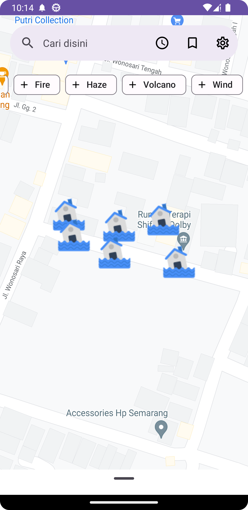
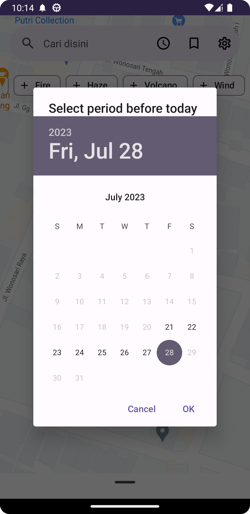
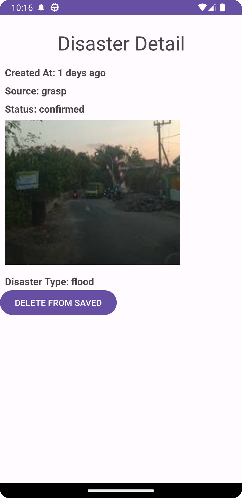
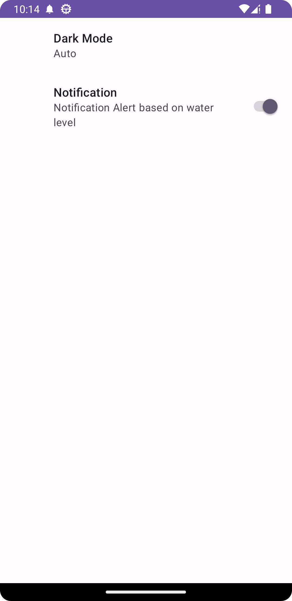

# Peta Bencana

Disaster Map is an application that helps users  to monitor various natural disasters occurring in Indonesia, such as floods, earthquakes, fires, haze, strong winds, and volcanic activities. This application offers real-time information on these disasters, keeping users well-informed with up-to-date data. Additionally, the application also have notification preference. If this notification preference turn on, users will get timely notifications about flood-affected areas in Jakarta, delivering real-time flood status updates. Moreover, the application includes a bookmark feature that allows users to save specific disaster information for future reference.


## Features

- List disaster in time period (MAX: 7 days)
- Filterable List (flood, earthquake, fire, haze, volcano, wind)
- Filter based on area (based on Province)
- Notification Alert based on water level (Only support Jakarta Area)
- Light/dark mode
- Animation Loading
- Bookmark disaster


## Built With
1. MVVM - A design pattern that separates the user interface from the business logic.
2. Hilt - A lightweight dependency injection framework for Kotlin.
3. Retrofit - Used for making network requests and handling API communication.
4. Room - A persistence library for Android that provides an abstraction layer over SQLite to work with local databases.
5. Glide - An image loading library for Android, used to efficiently load and display images in the app.
6. JUnit4 - Java testing framework that provides annotations and APIs for writing and running unit tests to ensure code functionality
7. Mockito -Java mocking framework that aids in creating mock objects for testing by simulating dependencies, enabling isolated and controlled unit testing.
   
## Installation

**Clone Project**
1. Clone this Project by running the following command in your terminal or Git command prompt:
```bash
  git clone ttps://github.com/GtFoBAE05/PetaBencana
```
2. Open the project in Android Studio.

3. Go to AndroidManifest.xml and add your Google Maps API key. You can obtain a key by following the instructions on the Google Maps documentation.

4. Go to ApiConfig.kt and change the baseUrl to "https://data.petabencana.id/".

**APK Installation**
1. Google Drive: \
   [midterm](https://drive.google.com/file/d/1c0BureeGaE7I3Xk9TdKmNbLNKGqQ5-mb/view?usp=sharing) \
   [final](https://drive.google.com/file/d/1Z0GWsn25ZyO1bQw5z04EBF6iUC37APqU/view?usp=sharing)
2. Github Release(Alternative)

## Testing Scenario
**Instrument Testing**
- map displayed
- bottom sheet displayed
- disaster chip group displayed
- disaster clickable
- search bar displayed and working
- date picker dialog displayed
- navigated to saved fragment working
- navigated to settins fragment working
**Unit Testing**
- ApiServices
- UrunDayaDAO
- AreaBanjirRepository
- UrunDayaRepository
- HomeViewModel
- SavedViewModel
- SavedDetailViewModel
- AreaBanjirList
- TimeUtils

**Instrument Testing Video Flow:**
[drive](https://drive.google.com/file/d/1j_9wXnC6J-23k_EiNu83-BNUhFk0We3q/view?usp=sharing)

**Unit Testing Coverage:**

 


## Screenshots

      


## Demo
[drive](https://drive.google.com/file/d/1cj1PCtFuxZR2yFDvwkc17gCrUb11l21u/view?usp=sharing) \
[youtube](https://youtu.be/s8dIwldJb20)


